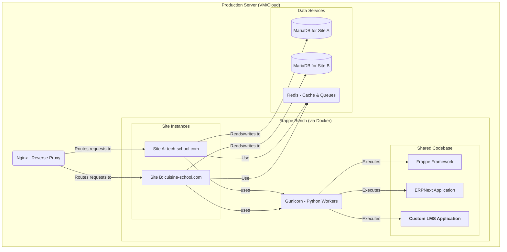
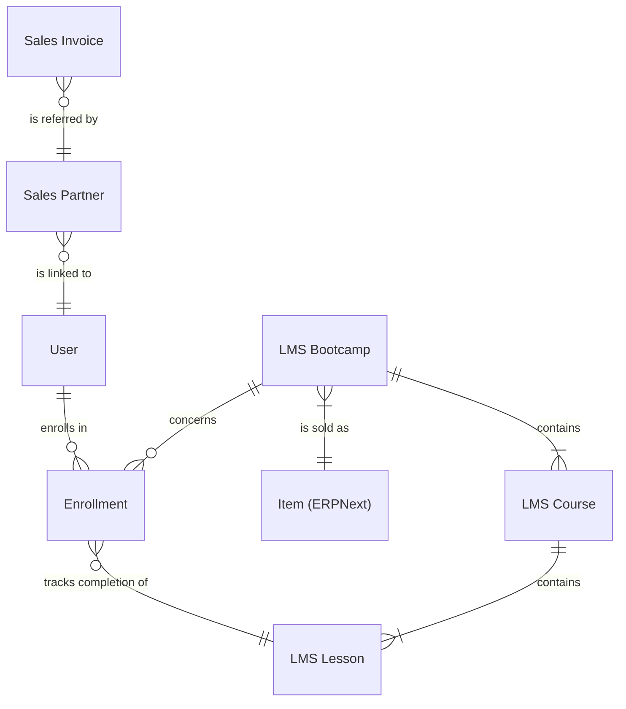

# Fullstack Architecture Document: Multi-School LMS Platform
Version: 1.0

Author: Winston (Architect)

Date: September 7, 2025

Reference: PRD v1.1, UI/UX Specification v1.0, Development Charter v1.0

## 1. Introduction
This document defines the complete architecture, from backend to frontend, for the Multi-School LMS platform. It serves as the single source of technical truth to guide development by AI agents, ensuring consistency across the entire technology stack.

## 2. High-Level Architecture

### 2.1. Technical Summary
The architecture is a **multi-site** web system based on the Frappe/ERPNext framework, fully containerized with Docker. A single shared codebase powers multiple independent "Schools", each with its own database and domain, ensuring complete isolation. The main business logic is contained in a custom Frappe application ("LMS").

### 2.2. Platform and Infrastructure
* **Platform:** Self-hosted on a cloud server (VPS) running Linux (Ubuntu 22.04 LTS recommended).
* **Containerization:** Docker and Docker Compose are used to manage the entire development and production environment, ensuring consistency and reproducibility.
* **Key Services:** Nginx (reverse proxy), Gunicorn (Python application server), MariaDB (database), Redis (cache and queues).

### 2.3. Repository Structure
* **Structure:** Monorepo. A single Git repository will contain the Docker configuration, custom `lms` application code, and site configuration.

### 2.4. Architecture Diagram
This diagram illustrates the interactions between the main system components.



## 3. Technology Stack (Tech Stack)
This stack is defined by the Development Charter and serves as the source of truth for the entire project.

| Category | Technology | Version | Role |
|----------|------------|---------|------|
| Framework | Frappe | v15.20.0 | System foundation (ORM, Admin UI) |
| Back-Office | ERPNext | v15.20.0 | Sales, customer, partner management |
| Database | MariaDB | 10.6 | Data storage for each site |
| Cache | Redis | 6.2-alpine | Performance caching |
| Queues | Redis | 6.2-alpine | Asynchronous task management |
| Web Server | Nginx | latest | Reverse proxy and multi-domain management |
| Backend Language | Python | (defined by Frappe image) | LMS application business logic |
| Frontend Language | JavaScript | (defined by Frappe image) | Public portals and client scripts |
| Testing | Python Unit Tests | (integrated with Frappe) | Critical business logic validation |

## 4. Data Architecture
The data model is based on Frappe's DocType system, as defined in the PRD.



## 5. API Specification
* **API Style:** REST. The Frappe framework automatically exposes a REST API for all DocTypes. CRUD operations (Create, Read, Update, Delete) are available via standard endpoints (e.g., `/api/resource/LMS Bootcamp`).
* **Authentication:** Authentication will be managed by Frappe's standard system (sessions or API tokens).

## 6. Project Structure
The project structure at the root will follow the configuration defined in the development charter.

```plaintext
/my-lms-project
|-- apps/
|   |-- lms/                # Our custom application
|   |   |-- lms/
|   |   |   |-- doctype/
|   |   |   |   |-- lms_bootcamp/
|   |   |   |   |-- lms_course/
|   |   |   |   |-- enrollment/
|   |   |-- www/              # Templates for public portals
|   |   |-- templates/
|   |   |-- public/
|   |-- erpnext/            # The ERPNext application
|-- docker-compose.yml      # Core of the environment
|-- sites/                  # Site data (managed by Docker Volume)
|-- README.md
```

## 7. Coding and Testing Standards
* **Backend (Python):** Formatting with **Black** following **PEP 8** standards.
* **Frontend (JavaScript):** Formatting with **Prettier**.
* **Testing:** All critical business logic (calculations, permissions, etc.) must be covered by Python **unit tests**, as required by the PRD.

## 8. Security
* **Isolation:** The multi-site model guarantees complete data isolation at the database level for each school.
* **Permissions:** Access to portals (Student, Affiliate) will be strictly controlled by Frappe's "User Permissions" system, based on the logged-in user.