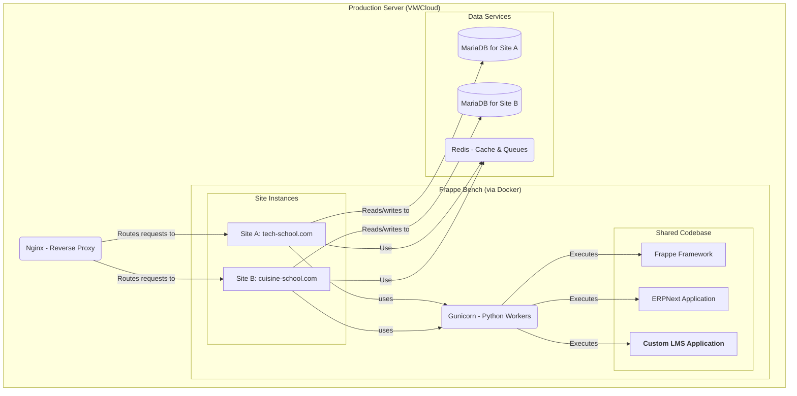

# 2. High-Level Architecture

## 2.1. Technical Summary
The architecture is a **multi-site** web system based on the Frappe/ERPNext framework, fully containerized with Docker. A single shared codebase powers multiple independent "Schools", each with its own database and domain, ensuring complete isolation. The main business logic is contained in a custom Frappe application ("LMS").

## 2.2. Platform and Infrastructure
* **Platform:** Self-hosted on a cloud server (VPS) running Linux (Ubuntu 22.04 LTS recommended).
* **Containerization:** Docker and Docker Compose are used to manage the entire development and production environment, ensuring consistency and reproducibility.
* **Key Services:** Nginx (reverse proxy), Gunicorn (Python application server), MariaDB (database), Redis (cache and queues).

## 2.3. Repository Structure
* **Structure:** Monorepo. A single Git repository will contain the Docker configuration, custom `lms` application code, and site configuration.

## 2.4. Architecture Diagram
This diagram illustrates the interactions between the main system components.

