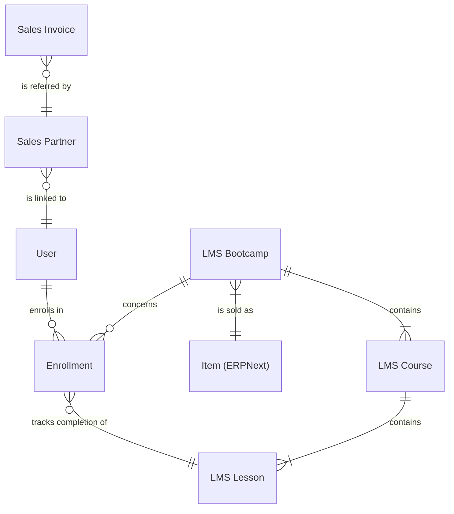

# 4. Data Architecture
The data model is based on Frappe's DocType system, as defined in the PRD.

```mermaid
erDiagram
    "User" ||--o{ "Enrollment" : "enrolls in"
    "LMS Bootcamp" ||--o{ "Enrollment" : "concerns"
    "LMS Bootcamp" }|--|| "Item (ERPNext)" : "is sold as"
    "LMS Bootcamp" ||--|{ "LMS Course" : "contains"
    "LMS Course" ||--|{ "LMS Lesson" : "contains"
    "Enrollment" }o--|| "LMS Lesson" : "tracks completion of"
    "Sales Partner" }o--|| "User" : "is linked to"
    "Sales Invoice" }o--|| "Sales Partner" : "is referred by"
```
