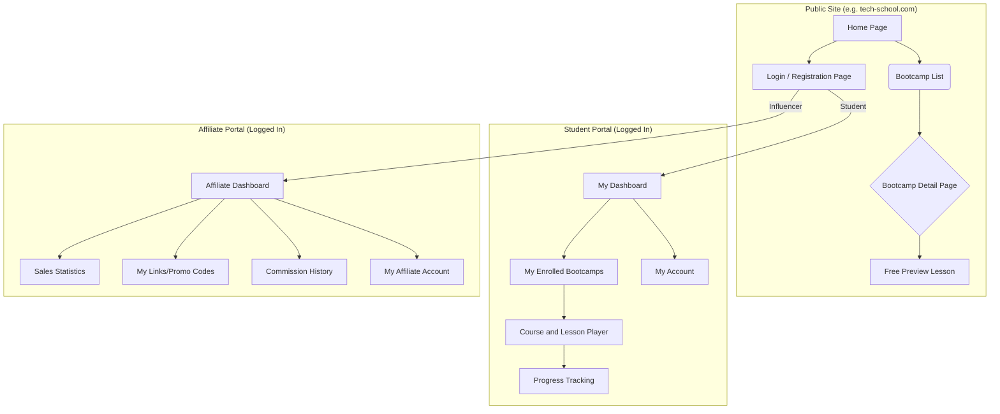

# UI/UX Specification: Multi-School LMS Platform
Version: 1.0

Author: Sally (UX Expert)

Reference: PRD - Multi-School LMS Platform v1.1

## 1. Introduction and Fundamental UX Principles

### Target Personas:

**The Administrator:** Needs efficiency and clarity to manage content and affiliates.

**The Student:** Seeks a simple, engaging, and frictionless learning experience.

**The Influencer:** Wants transparent and quick access to their performance and commissions.

### Usability Goals:

**Simplicity for Students:** Access to courses and progress tracking must be obvious.

**Efficiency for Admins:** Content creation must be quick and structured.

**Clarity for Influencers:** Commission tracking must be transparent and easy to consult.

### Design Principles:

**Clarity and Focus:** Each interface serves a specific purpose without distraction.

**Brand Consistency:** Each "school" can reflect its own visual identity while using the same base components.

**Encourage Progression:** The interface must motivate students to continue their learning.

## 2. Information Architecture (IA)

### Site Map / Screen Inventory:

### Navigation Structure:

**Main Navigation (Public Site):** Links to "Our Bootcamps", "About" and "Login".

**Student Portal Navigation:** Links to "My Courses", "My Progress", and "My Account".

**Affiliate Portal Navigation:** Links to "Dashboard", "My Campaigns", and "My Earnings".

## 3. User Flows

### Flow 1: Bootcamp Purchase by a New Student

**Objective:** A visitor discovers a bootcamp and purchases it.

**Steps:** Arrives on home page → Clicks on a bootcamp → Watches free previews → Clicks "Enroll" → Creates account → Proceeds to payment → Accesses student dashboard.

### Flow 2: Progress Tracking by a Student

**Objective:** A student continues their training.

**Steps:** Login → Arrives on dashboard → Clicks "Continue course" → Arrives on last viewed lesson → Navigates between lessons → Progress is updated automatically.

### Flow 3: Earnings Tracking by an Influencer

**Objective:** A partner checks their commissions.

**Steps:** Login to portal → Arrives on affiliate dashboard → Consults click and sales statistics → Checks total amount of commissions due.

## 4. Wireframes & Mockups (Conceptual)

### Design Files: High-fidelity mockups will be managed in an external tool (e.g., Figma). This document describes the concepts.

### Key Screen Concepts:

#### Bootcamp Detail Page:
- **Hero Zone:** Bootcamp title, presentation image/video, prominent price and "Enroll Now" call-to-action button.
- **Curriculum:** Clear list of modules and lessons, with a "play" icon for free previews.

#### Course Player (Student Portal):
- **Main Zone:** Lesson content (video, text).
- **Sidebar:** List of all course lessons with completion icons to visualize progress.

#### Affiliate Dashboard:
- **Key Indicators:** Prominently visible cards displaying "Monthly Sales", "Commissions Due", "Conversion Rate".
- **Sales Table:** List of recent attributed sales, with date and amount.

## 5. Style Guide and Components

### Approach: Use Frappe's standard component library for back-office ("Desk") and create a set of custom and reusable components for public portals.

### Base Components for Portals:

**Course Card:** Displays title, image, and price of a bootcamp.

**Buttons:** Primary ("Enroll") and secondary ("View Details") styles.

**Progress Bar:** Visual element indicating course completion percentage.

**Video Player:** Integrated video player with simple controls.

### Color Palette and Typography: These elements will be specific to each "school's" brand and can be configured by the Administrator.